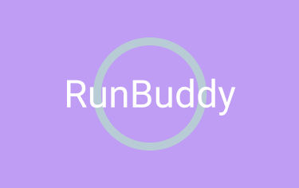
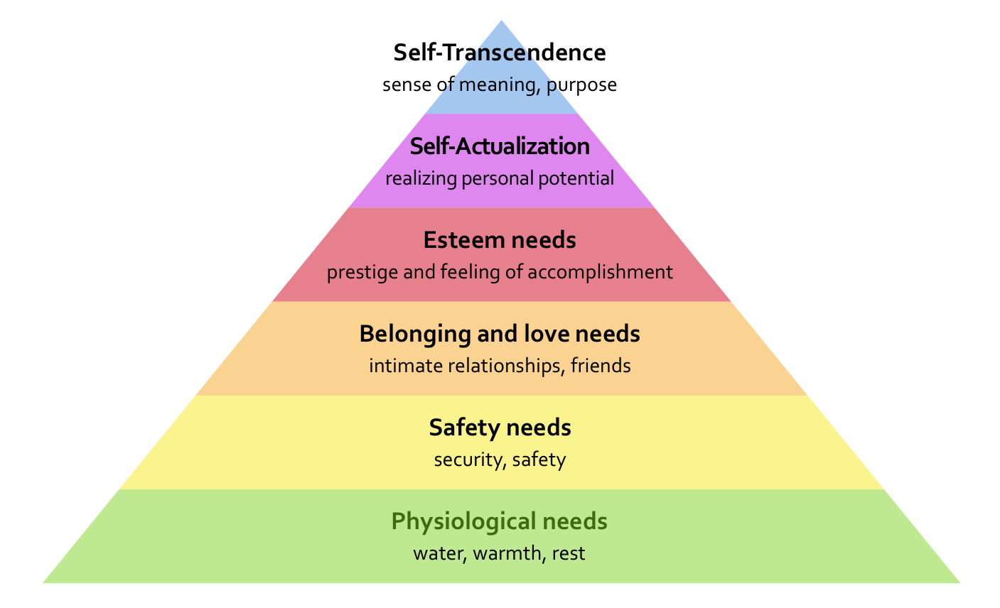
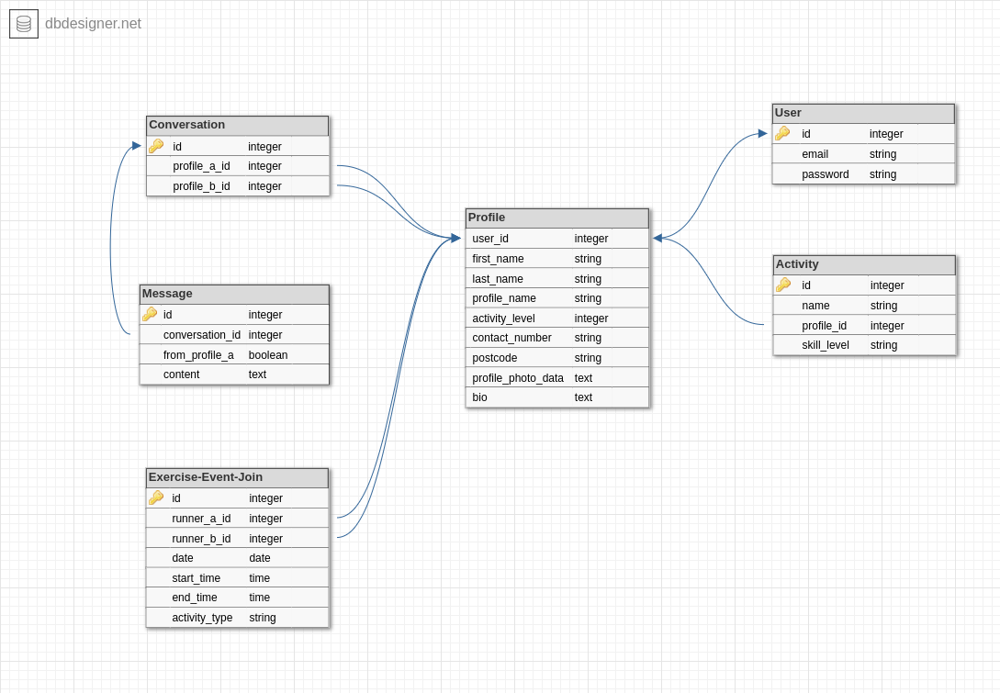
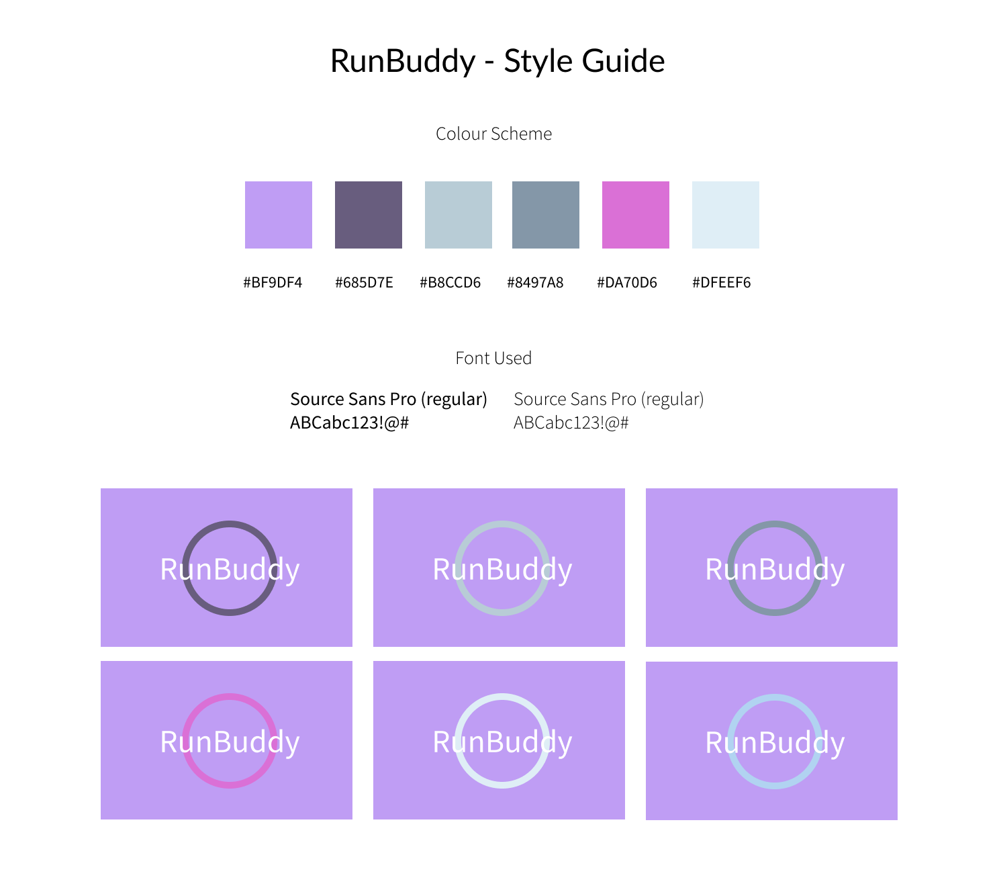
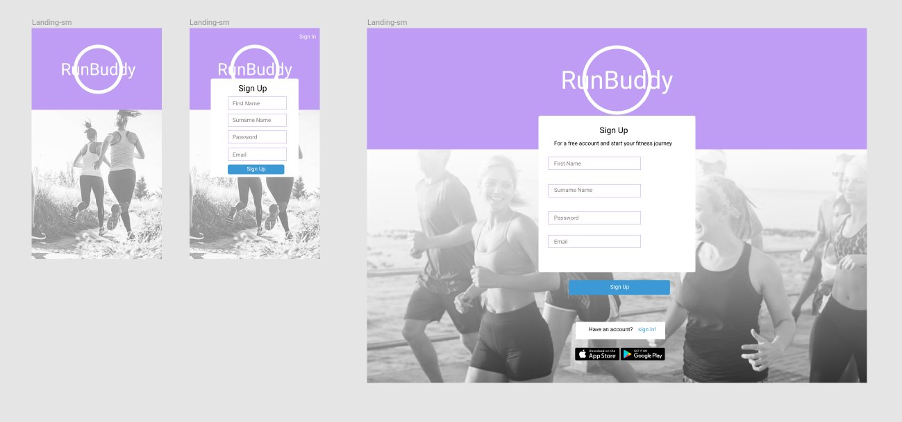

# *RunBuddy*



*RunBuddy is an app to connect women who want to run together for company, friendship and safety*


### Group Members
- George Kosmas
- Julia Ryan
- Brett Rapp
- Nick Sonner

## Hackathon Brief
In groups of 2-3 design an app addressing at least 2 fundamental human needs based on Maslow’s hierarchy.

### Maslow's Heirarchy


## What is RunBuddy?

*RunBuddy is an app designed to connect women who want to run together for company, friendship and safety*
The app should allow a user to sign up for an account, create a profile and search for other women in their neighbouring areas who have a similar run schedule and activity level.

The user can view other user’s profiles, and if they find someone that they may want to run with,
the user can then, initiate a conversation with the prospective running partner and work out a time and place if they are interested.

It’s then that it's recommended that they meet face to face or have video chat before they meet up, to verify that they are who their profiles present and encourage a social atmosphere.


## Technologies used

The following technologies were used.

```
Ruby 2.4.1
Rails 5.1
Postgresql
Amazon S3 Cloud Storage
```

### Gems/API

```
gem ‘dotenv-rails’, groups: [:development, :test]
gem ‘aws-sdk’, ‘~> 3’
gem ‘devise’
gem ‘bootstrap’, ‘~> 4.0.0.beta’
gem ‘jquery-rails’
gem ‘fastimage’
gem ‘image_processing’
gem ‘mini_magick’
gem ‘shrine’
gem ‘geocoder’
gem ‘rspec-rails’, ‘~> 3.6’
```

## User Stories:
We started with user stories, which were really helpful, they really helped us pinpoint
a lot of the minimum features required as well as the potential problems with the concept.
It also highlighting the interesting potential in idea, and how future additions could
shape the app into something viable.
```
In order to: Start my fitness journey
As a: beginner runner
I want to: find experienced runners to help me start.

In order to: easily schedule a run
As a: person with a busy schedule
I want to: I want to be able to propose and receive proposed run times with other runners, which I can accept, reject or reschedule

In order to: Feel secure as I exercise
As a: Safety conscious runner
I want to: find other women to run with

In order to: maintain my health
As a: health conscious person
I want to: feel safe if I intend to exercise

In order to: improve my fitness and health
As a: person who wants to exercise
I want to: have a safe and convenient way to exercise

In order to: Find new friends
As a: woman who has just moved to town
I want to: Find someone to run with similar interests

In order to: Find a running partner at my same level
As an: experienced runner
I want to: Run with someone who is at my level

In order to: Find a running partner who is ok running with a pram
As a: mother
I want to: Find other mothers with prams who want to run

In order to: Find someone who runs at the same time as me
As a: person with a busy schedule
I want to: Be able to see a list of people who run at specific times each day

In order to: Let others know I'm safe, or when I return home safe
As a: runner
I want: a trusted person to be automatically notified when my scheduled run is completed

In order to: Find a running partner
As a: runner
I want to: see who runs in my area

In order to: Contact a potential running partner
As a: person seeking a running partner
I want to: send a potential running partner a message

In order to: Let people know what I look like to confirm my identity
As a: member
I want to: Upload a photo of myself

In order to: easily find safe running routes
As a: safety conscious runner
I want to: see the top routes recommended by other users in my area.

In order to: ensure I am connecting with a real person
As a: a prospective runner
I want to: be able to meet/speak face to face

In order to: not forget about my run schedule
As a: keen runner
I want to: be reminded about my future runs

In order to: be reminded about my scheduled run
As a: runner
I want to: have the app automatically commence the run program including the safety notification at the end of the run unless I manually cancel the run
```

## Data Structure



### Models

#### User
```
- id(integer)
- email(string)
- password(string)
```

#### Profile
```
- user_id(foreign key)
- first_name(string)
- last_name(string)
- profile_name(string)
- postcode(string)
- profile_photo_data(text)
- bio(text)
- activity_level(integer)
- contact_number(string)
```

#### Activity
```
- id(integer)
- name(string)
- profile_id(foreign key)
- skill_level(integer)
```

#### Conversation
```
- id(integer)
- profile_a_id(foreign key)
- profile_b_id(foreign key)
```

#### Message
```
- id(integer)
- conversation_id(foreign key)
- from_profile_a(boolean)
- content(text)
```

#### Exercise-Event-Join
```
- id(integer)
- runner_a_id(foreign key)
- runner_b_id(foreign key)
- event_date(date)
- start_time(time)
- end_time(time)
- activity
```

## Design research | Style guide



We wanted the design to be simple and as clutter free as possible, to make the experience as user friendly. Eventually there would be a need to display a lot of information, so starting from a clean base, was the sensible place to start. We created a reference board on Pintrest, to collect images of profile and app UI layouts with similar characteristics to our intended design.

https://www.pinterest.com.au/nicksonner/hackathon-uiux/

The colour scheme intended to be bright but not too vibrant to the point where the UI could be unpleasant to look at.

Magenta was chosen as the starting point for our colour scheme as it is an uplifting colour and is commonly tied to themes of change, transformation and harmony which is thematically linked with the philosophies of our app.

Our chosen font was Source Pro Sans for its simplicity. With more time to develop, we would have liked to explore more options to find a font potentially more interesting but retaining the same simple and elegant characterstics that initially inspired us to choose Source Pro Sans.


## Wireframes



Initial wireframing really helped us understand how we wanted the user to use the app, and what would be the most intuitive way of using it. We started with sketching basic designs on paper (using the Pintrest board as reference) until we understood the flow of the user's journey, we then transferred the designs to figma and began incorporating our colour scheme.

Our wireframes are more to demonstrate the potential direction the app could take rather than a projected outcome of the project. With more time, we believe we could match the designs outlined in our wireframes, and further build upon them.

https://www.figma.com/file/LwQ8GD8EtEOKHKtQQ6iji6/RunBuddy?node-id=60%3A0

# Production

Julia started the project on her local machine using Postgresql and omitting rails default testing suite. We then created a new repo on github, where the rest of the team forked the project from, and installed all needed dependencies on our systems. We then installed the required Gems including Rspec and created a test database.

The next step was to install and initialise Devise and create the user model. Following this, we generated scaffolds for the remaining models.

We created a new S3 bucket on Julia's AWS account for hosting uploaded images. With that in place, Shrine was implemented to create an image uploader.

With the image uploader complete, the group broke into two where one group worked on the conversation/messaging feature while the other half of the group implemented the activities feature and a nested form, allowing new activities to be created and saved from the user's profile page.

When we had the majority of the functionality implemented, we deployed the app to Heroku, and continued working on polish and more implementation. Postcodeapi was implemented shortly after, which is used to display the corresponding suburb on a user's profile page.

With the remaining time we worked on styling the app, preparing the presentation and finalised the documentation.

## Challenges
#### Authorisation
One of the more complex challenges we faced was authorisation. Restricting access to other user's profile pages and the ability to edit other user's profile page was avoided by using Devise's authenticate_user! method to ensure that only logged in users could access pages past the landing page. Conditional statements were used to prevent logged in users from editing other user's profiles, accounts and activities. A better method would have been to implement CanCanCan or a similar authentication solution where guests wouldn't have any access to pages, they would only see the main page of the site. Users on the other would be able to see other user's profiles, and be able to modify or delete their own profiles and activities they created.

#### CSS
Due to time constraints, we were unable to make the app responsive. Another challenge was nested forms. In order to allow a user to select multiple exercise of interest, we created a separate model called activities, which would store the data for these exercises. However we didn't want a new user to have to fill in more than one profile form. In order to allow the user to select the exercise of choice within their profile form it was necessary to create a nested form for the activity model.

## Possible Future of this app
The idea behind RunBuddy opens up many interesting future possibilities.

#### Tracking the user's fitness level/progress
With the widespread adoption of wearable fitness trackers, the ability to track distance, progress and calories burned would be a very beneficial addition to the app. This would ideally mean that the user would only need one app (RunBuddy) to cater to their needs, rather than two.

#### Skype | Signal | Video Chat integration
In order for user’s to verify that their prospective running partner is legitimate, its would be highly recommended that they meet face to face or have video chat. The ideal situation would be for the users to be able to take part in video chats in their local client, without switching to another app.

#### Group implementation
Current functionality only allows two people to organise a running event. The ideal scenario would be to allow a group of users to be able to organise and schedule regular or individual events, and support this organisation with a more robust chat system and/or bulletin board system.

#### Automatic Notification of Start and End time of scheduled runs
One safety feature that would set this app apart from competeing apps is a feature where the app would automatically send a notification to both the user and any trusted partner/family member/individual notifying them that the user's run had commenced, and another at the scheduled end of the run. This would require the user to confirm that the run had started and had finished, allowing the trusted person to be notified that they had safely completed their run, and the could potentially follow up with them.

#### GPS tracking
Closely related to the notification feature, a GPS feature, allowing for a user's partner and/or trusted individual to see where the user is currently running/jogging, and their current chosen route (if using one) would

#### Local Crime Statistics (map)
Another safety feature that we would like to implement, would be hooking into local crime statistics to be able to highlight on a map, areas of assults, as to warn users to choose alternate routes in safer areas. The map would also display local safe areas and police stations.

#### User created, curated and reviewed running routes
As users use the app, we would like for the user to be able to create and share the routes they run with other users, and also meeting areas and route milestones. Obviously we would want the users to exercise caution, and would recommend the shared routes be in safe, populated areas.


## Potential Problems
Like any social media app, there is potential for abuse, which has definitely been taken into consideration. There's an inherent difficulty ensuring that users follow safe guidelines while using the app, and many security issues could potentially be worked around.

Another issue could be political in nature, how to enforce women only? Should it be women only? People who identify as being a woman?

Many of the safety features can be a double edged sword, and ideologically, in order to benefit from some of the safety features, the user would be giving up some privacy privileges
